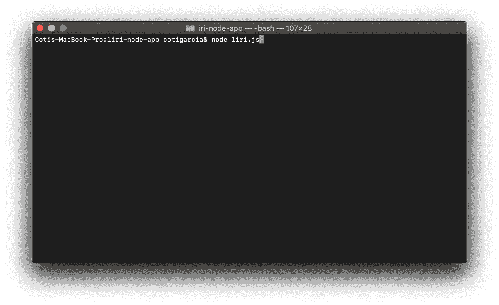
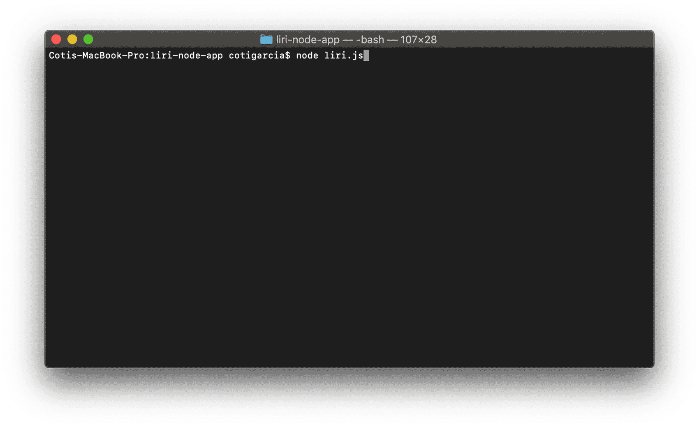
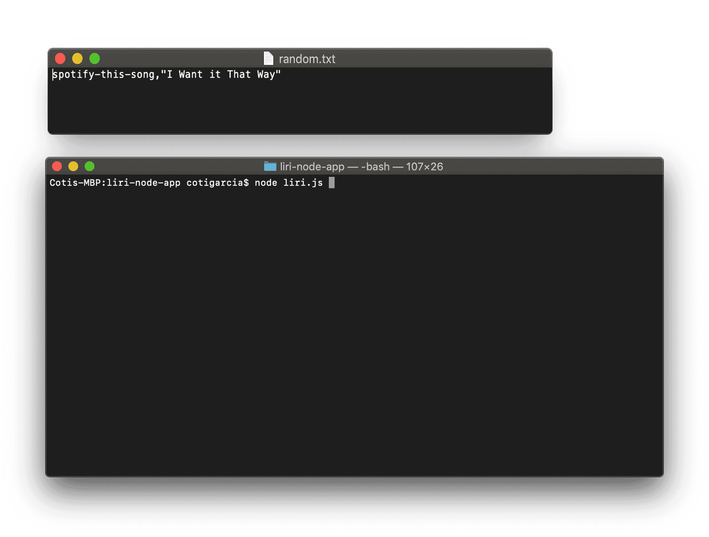

# liri-node-app

## Project Description
 LIRI, _Language_ Interpretation and Recognition Interface, is a command line node app that takes in parameters and gives you back data.

 LIRI will search Spotify for songs, Bands in Town for concerts, and OMDB for movies using three differents API. 

 To run this APP:
 * Clone this reposity
 * Install the modules that are required. (npm install)
 * Write in the command the parameters as shown in the exaples.

## Functionalities

Acoording to the user input, the app will run one of these four functions:

```javascript
switch (action) {
    case "concert-this":
        return concertThis(userInput);
    case "spotify-this-song":
        return spotifyThisSong(query);
    case "movie-this":        
        return movieThis(userInput);
    case "do-what-it-says":
        return doWhatItSays();   
}
```
Each function call the correct API throw "axios" or instaling a specif node_module.


## Examples

#### Spotify this song


#### Movie this


#### Concert this


#### Do What it says
